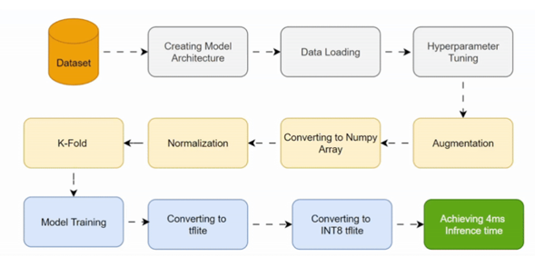

# 🛡️ Face Mask Detection using Transfer Learning

This project demonstrates **Face Mask Detection** using **Transfer Learning** techniques.  
It contains four Jupyter notebooks that explore different **deep learning models** and **datasets**, comparing the performance of **DenseNet121** and **MobileNetV2** on both **binary** and **multi-class classification** tasks.

---

## 📂 Repository Structure

| Notebook | Task | Model | Classes |
|----------|------|-------|---------|
| **DenseNet121_Dataset1.ipynb** | Binary Classification | DenseNet121 | `with_mask`, `without_mask` |
| **DenseNet121_Dataset2.ipynb** | Multi-class Classification | DenseNet121 | `with_mask`, `without_mask`, `incorrect_mask` |
| **MobileNetV2_Dataset1.ipynb** | Binary Classification | MobileNetV2 | `with_mask`, `without_mask` |
| **MobileNetV2_Dataset2.ipynb** | Multi-class Classification | MobileNetV2 | `with_mask`, `without_mask`, `incorrect_mask` |

---

## 📦 Datasets

1. **Dataset 1 (Binary Classification)** – [Face Mask Detection Dataset (with_mask / without_mask)](https://github.com/chandrikadeb7/Face-Mask-Detection)  
   Used for training DenseNet121 and MobileNetV2 binary classifiers.

2. **Dataset 2 (Multi-class Classification)** – [Face Mask Detector (with_mask / without_mask / incorrect_mask)](https://www.kaggle.com/datasets/spandanpatnaik09/face-mask-detectormask-not-mask-incorrect-mask)  
   Used for multi-class classification experiments with both models.

---

## 🔍 Highlights

- **Transfer Learning**: Fine-tuning DenseNet121 & MobileNetV2 for face mask detection.
- **Binary & Multi-class**: Detects masks in both simple and complex scenarios.
- **5-Fold Cross Validation** (for DenseNet121 binary case).
- **Hyperparameter Tuning**: Optimized dropout rates and dense layer sizes.
- **Data Augmentation**: Rotation, shifting, zooming, and more for better generalization.
- **Ultra-fast Inference**: As low as 0.004 seconds per image.

---

## ⚙️ Prerequisites

Install the following dependencies:

```bash
pip install tensorflow numpy pillow matplotlib scikit-learn opencv-python
```

You may also need:

- **p7zip-full** (Linux) or 7-Zip (Windows) for `.7z` extraction.
- Built-in modules: `os`, `zipfile`

**Main Libraries Used:**
- `tensorflow.keras` (DenseNet121, MobileNetV2, Model, Dense, Dropout, GlobalAveragePooling2D, Adam, to_categorical, ImageDataGenerator)
- `numpy`
- `Pillow`
- `matplotlib`
- `scikit-learn`
- `cv2`

---

## 🚀 Usage

1. **Download and extract datasets**:
   - Dataset 1: Clone from GitHub or download manually.
   - Dataset 2: Download from Kaggle and unzip into the specified folder.

2. **Run notebooks** in sequence for a smooth workflow:
   - `DenseNet121_Dataset1.ipynb`
   - `DenseNet121_Dataset2.ipynb`
   - `MobileNetV2_Dataset1.ipynb`
   - `MobileNetV2_Dataset2.ipynb`

---

## 🏗 Model Architecture



**Explanation of Workflow:**

1. **Dataset** – Input images for training and validation.
2. **Creating Model Architecture** – Define base model (DenseNet121 or MobileNetV2) + custom classification layers.
3. **Data Loading** – Read and structure data for training.
4. **Hyperparameter Tuning** – Optimize learning rate, dropout, dense units, etc.
5. **Augmentation** – Apply transformations to improve generalization.
6. **Converting to Numpy Array** – Store images in array format.
7. **Normalization** – Scale pixel values.
8. **K-Fold** – For stable cross-validation results.
9. **Model Training** – Train the model.
10. **Converting to TFLite** – Create lightweight model for deployment.
11. **Converting to INT8 TFLite** – Quantize for speed & small size.
12. **Achieving 4ms Inference Time** – Final optimized model performance.

---

## 📊 Performance Metrics

| Dataset | Model | Epochs | Batch Size | Inference Time (s) | Training Accuracy (%) | Validation Accuracy (%) |
|---------|-------|--------|------------|--------------------|-----------------------|-------------------------|
| Binary (GitHub Dataset) | MobileNetV2 | 16 | 32  | **0.004** | 99.55 | 98.70 |
| Multi-class (Kaggle Dataset) | MobileNetV2 | 16 | 32  | **0.005** | 99.80 | 99.70 |
| Binary (GitHub Dataset) | DenseNet121 | 32 | 128 | **0.040** | 98.70 | 99.20 |
| Multi-class (Kaggle Dataset) | DenseNet121 | 32 | 128 | **0.005** | 99.7 | 99.6 |

> **Note:** Inference time measured per image on test environment.

---

## 📈 Accuracy & Loss Plots

*(Insert training plots for each model and dataset)*  

### Example:
  
  

**Explanation:**  
- **Accuracy Plot** – Shows model improvement over epochs for both training and validation datasets.  
- **Loss Plot** – Depicts decrease in classification loss, indicating better fitting without overfitting.  


---

## 📜 License

This project is licensed under the **MIT License**.

---

💡 *By combining transfer learning and careful dataset preparation, this project shows how to quickly build accurate face mask detectors for real-world scenarios.*
